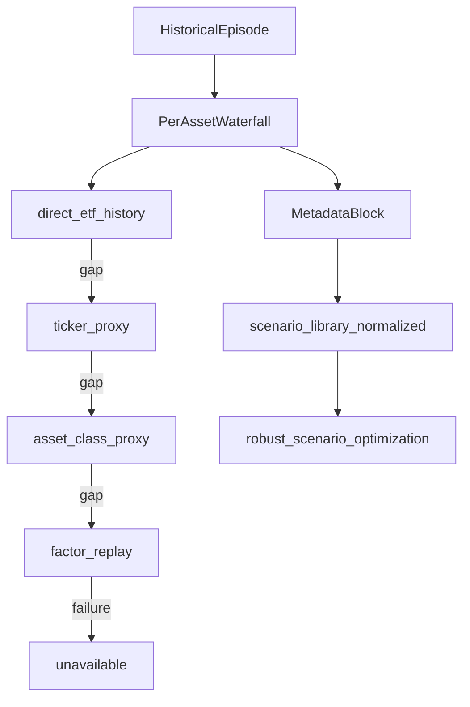

# Scenario-Based Robust Optimization v1 — ExecPlan

This ExecPlan is a living document. The sections `Progress`, `Surprises & Discoveries`, `Decision Log`, and `Outcomes & Retrospective` must be kept up to date as work proceeds.

Reference: [PLANS.md](../../PLANS.md) at repository root.

## Purpose / Big Picture

After implementation, an analyst can run a **separate** CLI (e.g. `python run_robust_scenario_optimization.py`) that consumes **`scenario_library_normalized.json`** (after enrichment described below), solves for long-only weights under policy-equivalent bounds, and writes **`robust_optimization_*` artifacts** with base metrics, stress tails, explicit fallback transparency, and comparator weights. The **default objective** is **maximize the mean scenario return over the worst lower-half slice**: for each candidate **w**, compute **`scenario_return_s(w)`** for every **optimization-eligible** scenario (including **`base_historical`** as **one** scenario outcome alongside stresses), sort returns **worst to best** (ascending numeric order), take the **⌈N/2⌉** worst scenarios (integer half rounded **up**, so the median outcome counts toward the stressed tail when **N** is odd — conservative), and maximize that average. **Stress penalties, concentration penalties, and optional base volatility** are **secondary regularizers** only (small configurable λ), not the primary objective. Post-optimization diagnostics report **5th / 10th / 25th percentile** of the scenario-return distribution **unless** Monte Carlo path expansion is enabled (future). The workflow preserves **deep historical crises (dotcom, 2008)** whenever **any** tier of the historical stress fallback can produce a usable estimate.

This remains additive: it does **not** replace `run_optimization.py`, does **not** change mandate release or stress **pass/fail** gates, does **not** remove existing optimizers, and does **not** overwrite realized ETF returns where direct history exists.

Verify: new fallback tests pass; normalized historical rows for dotcom/2008 show non-`excluded` roles when fallback quality permits; robust CLI produces outputs; existing optimizer tests unchanged.

## Progress

- [x] ExecPlan revised with historical stress fallback + **lower-half mean default objective** (`docs/exec_plans/2026-05-10_scenario_based_robust_optimization_v1.md`).
- [ ] Implement `src/historical_stress_fallback.py` (per-asset waterfall, metadata contract).
- [ ] Wire fallback into Scenario Library Normalized path ([src/scenario_library_normalized.py](src/scenario_library_normalized.py)) and/or library build so historical episodes carry enriched vectors without mutating upstream stress mandate outputs.
- [ ] Implement `src/robust_scenario_optimization.py` (inputs, eval, objectives, SLSQP, exporters).
- [ ] Implement `run_robust_scenario_optimization.py` (+ optional `robust_scenario_optimization` block in [src/config_schema.py](src/config_schema.py)).
- [ ] Add `tests/test_historical_stress_fallback.py` and `tests/test_robust_scenario_optimization.py`.
- [ ] Update [SPEC.md](../../SPEC.md) and [AGENTS.md](../../AGENTS.md).

## Surprises & Discoveries

- (During implementation) Record any tension between episode **buy-and-hold** fallback returns and **factor_replay** portfolio beta timing (weekly vs monthly alignment).

## Decision Log

- **Decision:** v1 **default primary objective** is **lower-half robust mean (variant B)** — the quantity to **maximize** is  
  **`LH(w) = (1/k) Σ_{j=1..k} r_{(j)}(w)`**  
  where **`r_{(1)} ≤ … ≤ r_{(N)}`** are the **`scenario_return_s(w)`** values over **`N`** optimization-eligible scenarios sorted **worst to best**, and **`k = max(1, ⌈N/2⌉)`** (worst **half**, rounding **up**). **`base_historical`** contributes **exactly one** **`r_s(w)`** (typically **`μ'w`** on the normalized base slice); it is **not** a separate sole headline objective — it sits in the same sorted pool as synthetic and historical stresses.

  **Secondary regularizers only** (subtract from **`LH`** or add as penalty terms minimized jointly via weighted sum with **small defaults**): base volatility **`σ_base(w)`**, soft stress slack **`Σ c_s P_s(w)`**, asset/factor concentration **`λ_HHI`** terms, optional feasibility slack. These **must not dominate** **`LH`** under default config (document default λ scale in YAML).

  **Alternate CLI modes** remain available for experiments: **maximin worst scenario** (variant A), **legacy hybrid** (prior “base return minus large stress penalties”), and **pure lower-half** with **λ=0** regularizers.

  **Rationale:** Matches the product ask: optimize the **bad-scenario tail average** over a named scenario set; keep **`base_historical`** inside that set; use penalties as light shaping, not the main driver.

- **Decision:** **Percentile diagnostics (5th / 10th / 25th)** are **post-optimization reporting only** on the **ordered discrete scenario returns** at the optimal **w** (and optionally at comparator weights). They **do not** define the objective unless **`monte_carlo_paths_available`** (future) supplies enough samples to treat percentiles as stable statistics — document **`percentile_diagnostic_only: true`** in summary JSON when path count is below threshold.

- **Decision:** **Historical episode returns for optimization** use a **per-asset waterfall**. For each risk ticker and each historical scenario window, assign `R_{i,ep}` by the **best available** method in strict priority order, **without ever replacing** observed direct ETF history where the ETF has valid prices over the episode interval.

  **Tier 1 — direct ETF history (`historical_stress_method=direct_etf_history`).** Use compounded simple returns from the **portfolio’s own ticker** on aligned **`monthly_returns`** (or daily panel resampled consistently with project rules when monthly cells exist).

  **Tier 2 — ticker proxy (`ticker_proxy`).** If direct history is insufficient for that asset in that episode, map the ticker to an older or broader proxy with full episode coverage. Proxies are **explicit configuration** (recommended file `config/historical_stress_proxy_map.yml` or a subsection under `robust_scenario_optimization` / `scenario_library` in YAML). Illustrative defaults for documentation only (final mappings are config-owned): VOO→SPY (or agreed large-cap US equity proxy); SCHD→dividend/value equity proxy; BND→US aggregate bond proxy; SCHP→TIPS proxy (e.g. TIP); TLT→long Treasury proxy; GLD→gold proxy series; SLV→silver/commodity proxy. Every substitution is stamped in metadata (`assets_with_proxy_history`, warnings listing ticker→proxy).

  **Tier 3 — asset-class proxy (`asset_class_proxy`).** If no ticker-level proxy is configured or available with adequate coverage, map the asset to an **asset-class bucket** (US equity; growth/tech equity; dividend/value equity; aggregate bonds; TIPS; long Treasuries; gold; silver/commodities). Use a **class representative series** that spans the episode (from config, e.g. SPY/QQQ/IEF/TIP/GLD crosses), compute class episode return, and assign that **same class return** to all assets in that bucket for that episode slice only. Metadata marks `assets_using_asset_class_proxy`.

  **Tier 4 — synthetic historical replay / factor replay (`factor_replay`).** If tiers 1–3 cannot supply a finite return for an asset, approximate asset return using **realized crisis-period factor shocks** (from existing stress / factor history: equity, rates, credit, inflation, commodities/oil, USD when available) multiplied by **current** asset factor loadings (same convention as [`src/stress.py`](../../src/stress.py) per-asset shock map, using episode‑appropriate beta source documented in metadata — default **5Y** with optional adjusted overlay flag). Mark `assets_using_factor_replay`.

  **Portfolio-level episode return** remains linear in weights: `r_ep(w)=Σ_i w_i · R_{i,ep}` with each `R_{i,ep}` taken from its tier.

  **Rationale:** Preserves dotcom/2008 for robust optimization while respecting “don’t fake history where we have it.”

- **Decision:** **Classification rule for historical stresses** — Do **not** auto-**exclude** dotcom or 2008 solely due to “insufficient ETF-level episode covariance” flags from upstream analytics. After fallback enrichment, assign **`optimization_role`** from **`scenario_quality_status`** and coverage:

  - **`hard_stress_constraint`** when fallback depth is mostly **direct + ticker_proxy**, episode coverage ratios exceed configured thresholds, and factor/beta coverage is strong.

  - **`soft_constraint`** when a mix includes **asset_class_proxy** or lighter ticker proxies, or covariance quality is middling but finite scenario returns exist for all risk assets.

  - **`diagnostic_only`** when **`factor_replay`** dominates, coverage is thin, or contradictions across tiers trigger caution flags — still **report** outcomes post‑optimization.

  - **`excluded`** only when **`historical_stress_method`** resolves to **`unavailable`** for one or more risk assets with no repair path, or PSD / finite‑return checks fail globally.

  **Rationale:** Aligns optimization readiness with **recoverability** of stress signal, not ETF listing dates alone.

- **Decision:** **Required metadata block** on every historical scenario consumed by normalization / robust optimization (extend normalized scenario dict):  
  **`historical_stress_method`** — one of `direct_etf_history`, `ticker_proxy`, `asset_class_proxy`, `factor_replay`, `unavailable` (portfolio-level tag is the **dominant** or **worst** tier across assets per documented rule, plus **per-asset** map in nested field);  
  **`proxy_coverage_ratio`** — share of episode months (or weeks if documented) with non‑NaN data for the chosen series;  
  **`assets_with_direct_history`**, **`assets_with_proxy_history`**, **`assets_using_asset_class_proxy`**, **`assets_using_factor_replay`** — disjoint partition of risk tickers (cash excluded);  
  **`scenario_quality_status`** — enum compatible with existing quality vocabulary where possible (`reliable` / `usable` / `low_confidence` / `insufficient_data`);  
  **`warnings`** — human-readable and machine codes (proxy used, thin coverage, frequency mismatch).

  **Rationale:** Audit trail for least‑worst optimization and PDF/report disclosures.

- **Decision:** **Σ and covariance for historical scenarios.** Continue to use **stress scenario analytics** asset covariance when present and PSD‑repaired; if episode sample covariance remains unusable, allow **factor‑implied** or **proxy‑based** covariance only as **secondary** (document in warnings) or omit scenario‑specific Σ and rely on factor_replay return + base Σ for vol penalty — exact choice is implementation detail recorded in Decision Log during coding.

- **Decision:** **`confidence_weight`** still scales **penalties only**, never raw scenario returns. For fallback-heavy episodes, cap **`confidence_weight`** by **`scenario_quality_status`** per normalized rules.

- **Decision:** **Integration locus.** Implement fallback core in **`src/historical_stress_fallback.py`**. Call it from **`build_scenario_library_normalized`** (or immediately upstream when assembling historical rows) so **`scenario_library_normalized.json`** remains the single optimization‑input contract. **Do not** change **`run_stress`** pass/fail or mandate code paths; upstream **`stress_report`** realized PnL rows stay raw.

- **Decision:** **Solver** — **SLSQP** (or equivalent smooth constrained optimizer) on **`−LH(w) + regularizers`**; prefer **multi-start** from EW / RP / policy weights because **`LH`** is **non-smooth** if **k** changes discontinuously — **implementation note:** either smooth with soft-sort surrogates **or** fix scenario ordering breaks via checking adjacent swap boundaries (document chosen approach in Decision Log at coding time). If standard smooth formulation is required for v1, use **fixed k** worst scenarios by **scenario_id order tie-break** only when returns tie — rare.

  **Rationale:** Lower-half-of-sorted-values is standard “robust welfare” but needs careful differentiability; ExecPlan allows piecewise-linear handling via subgradient search or enumeration for **small N**.

## Outcomes & Retrospective

(To be filled at milestone completion.)

## Context and Orientation

**Existing layers:**

- [src/scenario_library.py](../../src/scenario_library.py) and [src/scenario_library_normalized.py](../../src/scenario_library_normalized.py) supply scenarios and roles.
- [src/stress.py](../../src/stress.py) defines shock-to-beta mapping for synthetic and factor replay.
- [src/stress_scenario_analytics.py](../../src/stress_scenario_analytics.py) provides episode windows and covariance diagnostics.
- ETF/stock taxonomy in [config/etf_universe.yml](../../config/etf_universe.yml) supports asset-class buckets.

**Terms:** **Fallback tier** is one of the four methods above; **per-asset waterfall** means each ticker picks its **own** highest-priority feasible tier; **portfolio-level method tag** summarizes worst or dominant tier for sorting and reporting.

## Historical stress fallback — architecture summary

The fallback builder receives: episode id, `episode_start` / `episode_end`, list of **risk tickers**, `monthly_returns` (and optional daily for coverage checks), proxy map config, taxonomy for asset class, `stress_report` slices for factor histories and betas. It outputs: **`R_vector`** aligned to tickers, **`per_asset_method`**, **`scenario_quality_status`**, **`proxy_coverage_ratio`**, partition lists, and **`warnings`**. Normalization merges this into each historical scenario before **`optimization_role`** / **`confidence_weight`** are assigned. The robust optimizer treats **`r_ep(w)=w·R`** like other linear scenarios; diagnostics CSV repeats metadata for audit.

## Answers to the Twelve Product Questions (updated)

1. **What is optimized?** **w** on risk tickers maximizing **`LH(w)`** (lower-half mean of optimization-eligible scenario returns) **by default**, plus **small** secondary regularizers; alternate modes **A** / legacy hybrid via CLI.

2. **Which scenarios in v1?** The **LH** pool **`{s}`** includes **`base_historical`** (one outcome **`r_base(w)`**) **plus** every synthetic and historical episode that is **`hard_stress_constraint`** or **`soft_constraint`** after fallback — explicitly **including dotcom and 2008** when metadata shows anything better than **`unavailable`**. Roles **`excluded`** never enter the pool; **`diagnostic_only`** stay out of **`LH`** but appear in post-opt tables.

3. **Ignored / diagnostic-only?** **Macro regimes** remain **`diagnostic_only`** for weight selection. Historical episodes are **`diagnostic_only`** only when fallback quality is weak; **`excluded`** only when no reliable fallback exists for required assets.

4. **Scenario returns?** Base μ′w; synthetic linear shock map; historical **`r_ep(w)=Σ w_i R_{i,ep}`** with **`R_{i,ep}`** from per-asset waterfall. **Realized direct ETF path is never overwritten**; proxies fill **gaps only**.

5. **Scenario risks?** Prefer **`sqrt(w'Σ_s w)`** from normalized monthly Σ when valid; document fallback when Σ missing.

6. **v1 objective?** **Default: maximize `LH(w)`** (mean of **`⌈N/2⌉`** worst scenario returns after sorting eligible **`scenario_return_s(w)`**). **Optional:** maximin (**A**), legacy hybrid (**D**). Regularizers secondary.

7. **Constraints?** Unchanged — reuse `_build_bounds` and optional stress caps.

8. **Confidence weights?** Unchanged — scale penalties / slack, not returns.

9. **Outputs?** Same six artifacts; include **`lower_half_mean`**, full **sorted scenario returns at optimum**, **`percentile_diagnostics_only`** flag, **`p05/p10/p25`** on discrete scenarios; **add** fallback columns / nested metadata (`historical_stress_method`, coverage, asset partitions, warnings).

10. **Tests?** Extended — see Validation.

11. **Limitations?** Proxy and asset-class returns introduce **mapping error**; factor_replay omits idiosyncratic episode noise; mixed tiers reduce comparability across assets; **small N** makes **`LH`** coarse and makes **5/10/25th** empirical percentiles **diagnostic-only**; **`LH`** non-smoothness may require specialized optimization tactics; base scenario inside the pool can **pull** the tail average toward “normal” times unless stress scenarios dominate spread.

12. **Monte Carlo later?** Unchanged — sample paths from `(μ_s, Σ_s)` per scenario.

## Plan of Work

**New module** [src/historical_stress_fallback.py](../../src/historical_stress_fallback.py): pure functions **`build_historical_episode_asset_returns(...)`** returning vector + metadata; **`dominant_historical_stress_method(...)`** helper for portfolio-level tag; unit-testable without full report.

**Config:** Add **`config/historical_stress_proxy_map.yml`** (or nested YAML) listing ticker→proxy, asset-class→representative ticker, minimum **`proxy_coverage_ratio`** thresholds, and optional episode-specific overrides.

**Normalization:** Extend [src/scenario_library_normalized.py](../../src/scenario_library_normalized.py): remove or narrow the branch that classes dotcom/2008 as **`insufficient_data`** **only** because of **`historical_asset_cov_insufficient`** when fallback yields usable returns; call fallback builder; attach metadata; set **`optimization_role`** per new classification rule; populate **`scenario_asset_return`** dict in normalized output for historicals where absent today.

**Robust optimization module** [src/robust_scenario_optimization.py](../../src/robust_scenario_optimization.py): read enriched normalized JSON; build per-scenario **`r_s(w)`** (including **`base_historical`**); implement **`compute_lower_half_mean(w)`**; objective **`maximize LH(w) − regularizers`** with defaults emphasizing **`LH`**; export **`LH*`**, sorted scenario table, and **p05/p10/p25** diagnostics flags.

**CLI** [run_robust_scenario_optimization.py](../../run_robust_scenario_optimization.py): **`--objective-mode lower_half_mean`** default; `--objective-mode maximin|hybrid_legacy`; regularizer λ overrides; proxy map path optional.

**Docs:** SPEC + AGENTS; mention fallback in one sentence under Scenario Library Normalized if appropriate.

## Concrete Steps

Working directory: repository root.

    python -m pytest tests/test_historical_stress_fallback.py tests/test_scenario_library_normalized.py -q
    python -m pytest tests/test_robust_scenario_optimization.py -q
    python run_robust_scenario_optimization.py --config config.yml

Expect: dotcom/2008 normalized rows show fallback metadata and non-excluded roles when data permits; tests pass.

## Validation and Acceptance

**Historical fallback tests** (`tests/test_historical_stress_fallback.py`):

- Direct history present → tier 1 used; proxy config ignored for that asset.

- Missing ETF span → tier 2 proxy return used; metadata lists substitution.

- Missing proxy → tier 3 class return applied; all tickers in same class get identical episode move.

- Missing class → tier 4 factor_replay produces finite return; warnings include `factor_replay`.

- Partition fields sum to full risk universe; no asset double-counted across buckets.

**Normalized + robust tests:**

- Dotcom/2008 fixtures: with mocks, **`optimization_role` ≠ excluded** when fallback succeeds.

- **`excluded`** only when `historical_stress_method` is `unavailable` for mandatory assets.

- **`confidence_weight`** affects **regularizer / penalty** terms only, **not** the raw **`r_s(w)`** entering **`LH`**.

- **Lower-half objective:** toy returns **`[−0.10, −0.05, 0.01, 0.02]`** → **`k=2`**, **`LH=−0.075`**; odd **N=5** verify **`k=3`** and correct subset.

- **Base in pool:** fixture includes **`base_historical`** row — **`N`** counts it once; sorting places it correctly vs stresses.

- Regression: existing **`tests/test_scenario_library_normalized.py`** updated for new behavior; optimizer tests unchanged.

## Idempotence and Recovery

Re-running report + normalization regenerates enriched JSON; rerunning robust CLI overwrites robust outputs only.

## Artifacts and Notes

**Example** nested historical metadata on normalized scenario (indicative keys): `historical_stress_metadata.historical_stress_method`, `per_asset`, `proxy_coverage_ratio`, `assets_with_direct_history`, `scenario_quality_status`, `warnings`.

## Interfaces and Dependencies

**New:**

    build_historical_episode_asset_returns(
        *,
        scenario_id: str,
        episode_start,
        episode_end,
        risk_tickers: list[str],
        monthly_returns: pd.DataFrame,
        stress_report: dict | None,
        proxy_config: dict,
        taxonomy: dict | None,
    ) -> tuple[np.ndarray, dict[str, Any]]

**Robust optimization:**

    compute_scenario_returns_vector(w, inputs) -> np.ndarray  # length N eligible

    lower_half_mean(scenario_returns: np.ndarray) -> tuple[float, int, slice]

    robust_objective(
        w: np.ndarray,
        inputs: RobustOptInputs,
        *,
        objective_mode: str = "lower_half_mean",
        lambdas: dict[str, float],
    ) -> float  # loss to minimize (negative LH + regularizers)

**`build_robust_optimization_inputs`** must ingest **`scenario_asset_return`** and historical metadata from normalized rows and enumerate eligible scenario ids **including `base_historical`**.

**Dependencies:** `numpy`, `pandas`, existing `stress` shock map, `etf_universe` / taxonomy readers for asset class.

---

*Revision note (2026-05-10): Added per-asset historical stress fallback hierarchy (proxy → asset class → factor replay), revised classification so dotcom/2008 are preserved when recoverable, required metadata contract, and split implementation into `historical_stress_fallback` + normalized integration before robust optimization.*

*Revision note (2026-05-10, later): **Default objective** switched to **lower-half mean** of optimization-eligible **`scenario_return_s(w)`** with **`k = ⌈N/2⌉`** worst scenarios after sorting; **`base_historical`** is one pooled outcome; stress/concentration/vol terms are **secondary regularizers**; **p05/p10/p25** are **diagnostic-only** unless Monte Carlo paths exist.*
