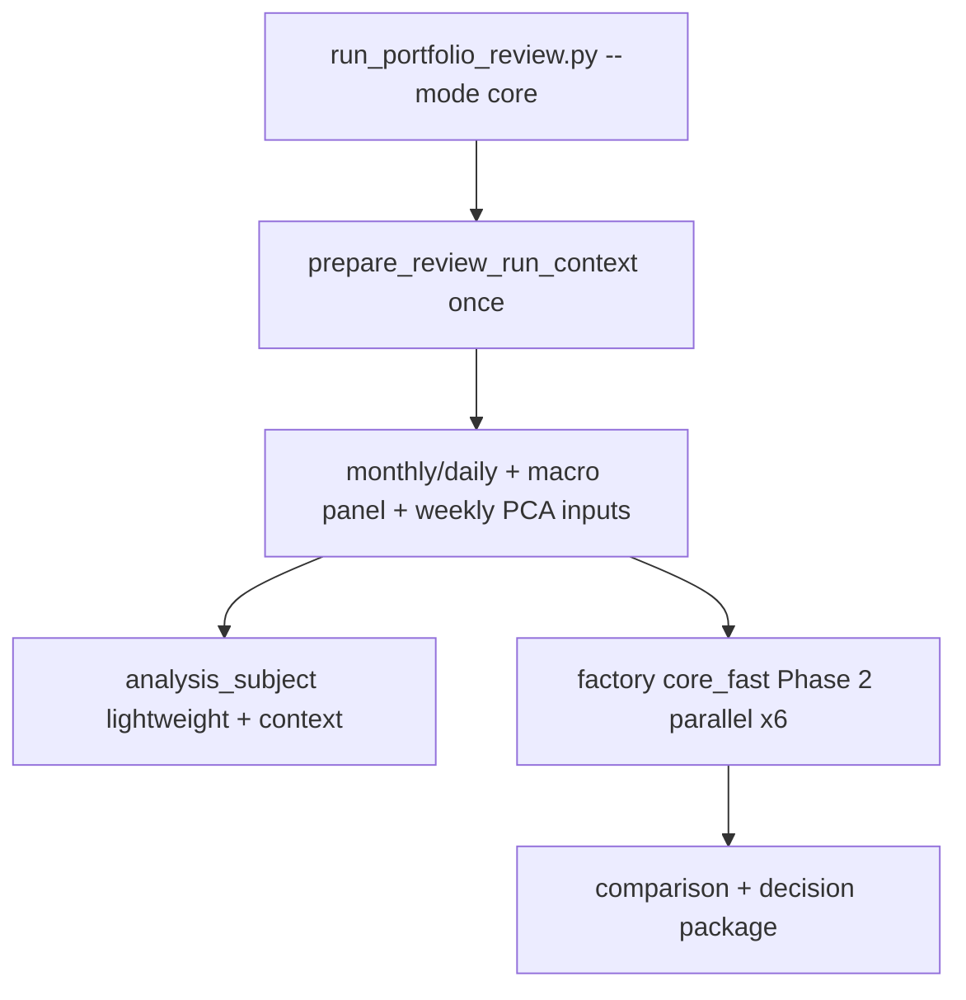

# Blocks 1–5 Performance Wave 2 ExecPlan (core_fast ≤ 5 min)

This ExecPlan is a living document. The sections `Progress`, `Surprises & Discoveries`, `Decision Log`, and `Outcomes & Retrospective` must be kept up to date as work proceeds.

This plan follows [PLANS.md](../../PLANS.md) in the repository root.

**Status:** Completed (Session 8 closed 2026-05-24; **`core_fast` E2E 210.7 s** — acceptance gate **PASS**).

**Roadmap ID:** `RM-983`

**Origin evidence:** [2026-05-24 Blocks 1–5 E2E Timing Audit](../audits/2026-05-24_blocks_1_5_e2e_timing_audit.md)

**Prerequisites (completed):** [Shared Evidence](../exec_plans/2026-05-23_candidate_factory_shared_evidence_plan.md), [Parallel Lightweight Reports](../exec_plans/2026-05-22_candidate_factory_parallel_reports_plan.md) (implementation exists; **opt-in only today**).

**Constraint (non-negotiable):** orchestration, caching, and profile routing only. No formula, weight, stress PnL, `candidate_comparison.json` schema/ranking, or decision semantics changes.

---

## Repository artifact (mandatory)

This ExecPlan **must live in the repository** as a checked-in Markdown file — not only in chat or Cursor-local plan storage.

| Requirement | Value |
| --- | --- |
| **Canonical path** | [`docs/exec_plans/2026-05-24_blocks_1_5_performance_wave2_plan.md`](2026-05-24_blocks_1_5_performance_wave2_plan.md) |
| **Format** | Markdown (`.md`), per [PLANS.md](../../PLANS.md) ExecPlan skeleton |
| **Register** | Row in [`docs/exec_plans/README.md`](README.md) with status **Active** and pointer to this file |
| **Updates** | Every session updates **this file** (`Progress`, `Decision Log`, timing evidence links) before claiming session done |
| **Session 0 gate** | File exists at canonical path + README pointer set — **no implementation starts without this** |

Cursor plan copies (`.cursor/plans/`) are optional convenience; **`docs/exec_plans/*.md` is the source of truth** for agents and operators.

---

## Purpose / Big Picture

The business target is **not** “a bit faster than 9 minutes.” The default Blocks 1–5 product path must reach **≤ 5 minutes warm-cache end-to-end** for the routine core review (`core_fast`), while **`--mode full` / `full_report` keeps complete diagnostics**.

After this wave, an operator runs:

```bash
python run_portfolio_review.py --mode core
```

and observes (warm cache, 8-ticker proof portfolio):

- **`analysis_subject` materialized once** using shared `ReviewRunContext` (no repeated macro panel / PCA downloads / daily reloads)
- **Candidate factory Phase 2** on the same 6 candidates as today’s `core_v1`, but with **parallel lightweight reports** and shared caches
- **All comparison-critical JSON unchanged** (`snapshot_10y`, stress summary fields, weights, `fair_comparison_ready` rules)
- **Total wall clock ≤ 300 s**, or a closure report that states **exact remaining seconds and blockers** — the wave is **not** closed as success at ~7–8 minutes.

---

## Measured baseline (2026-05-24, warm cache, sequential, no parallel)

| Scenario | Total E2E | analysis_subject | Factory wall | Factory `report_seconds` | Decision package |
| --- | ---: | ---: | ---: | ---: | ---: |
| **core_v1** (current `--mode core`) | **542.5 s** | 114.1 s | 426.6 s | 410.7 s | 1.7 s |

Factory aggregate blocks (6 candidates, sequential): macro_regime 60s, daily_tail_risk 35s, snapshots 33s, portfolio_pca 22s.

**Parallel reference (prior audit, 16 candidates):** factory wall **877 s → 631 s** (~28% wall reduction, 4 workers) — [Parallel Session 06](../audits/2026-05-22_candidate_factory_parallel_reports_session06_timing_audit.md).

---

## Hard acceptance target (business)

| Metric | Target | On failure |
| --- | --- | --- |
| **`core_fast` E2E wall clock** (warm cache) | **≤ 300 s** | Wave stays **open**; publish blocker table with **remaining seconds per stage/block** |
| Comparison parity | All existing parity tests pass | Block release |
| `pdf_seconds` | 0 on core_fast path | Block release |
| `--mode full` behavior | Unchanged full diagnostics | No regression vs current full sequential path |

**Do not close this wave** with narrative like “7–8 minutes is good enough.” That is explicitly out of acceptance.

---

## Product definitions

### `core_v1` (unchanged candidate menu)

Same six candidates as today: benchmarks + risk budgets ([`CORE_V1_CANDIDATE_ORDER`](../../src/candidate_factory.py)). Kept for backward compatibility and parity reference runs.

### `core_fast` (new routine product profile)

**Same six candidate IDs and weights as `core_v1`.** Differences are orchestration only:

| Dimension | `core_v1` (legacy reference) | `core_fast` (new default for `--mode core`) |
| --- | --- | --- |
| Factory profile id | `core_v1` | `core_fast` (alias menu → same 6 ids) |
| `ReviewRunContext` | optional / none | **required** — prepared once before subject |
| `analysis_subject` report | full report path today | **`lightweight_comparison` + shared context** (minimum sidecar evidence per [portfolio_review_workflow_spec.md](../specs/portfolio_review_workflow_spec.md)) |
| Candidate Phase 2 | sequential lightweight | **parallel lightweight** (default 4 workers) |
| Shared caches | partial (factory context only) | macro panel, PCA weekly inputs, daily/monthly frames |
| Lightweight trims | no | 10Y-only tail-risk loop; 10Y-only snapshot writes |
| Full diagnostics (3y/5y snapshots, rolling exports, etc.) | partial on lightweight | **still omitted** — use `--mode full` |

### `--mode full` (unchanged intent)

Continues to use `default_v1`, sequential factory (unless operator opts into parallel), and **`full_report` / full diagnostic paths** for deep-dive. No speed target on full mode in this wave.

---

## Architecture



**Key files:**

- [`src/portfolio_review_workflow.py`](../../src/portfolio_review_workflow.py) — orchestration, new core_fast routing
- [`src/candidate_run_context.py`](../../src/candidate_run_context.py) — extend to `ReviewRunContext` / v6
- [`src/candidate_factory.py`](../../src/candidate_factory.py) — `core_fast` profile; parallel default when profile is `core_fast`
- [`run_report.py`](../../run_report.py) — cache-aware macro/PCA/tail/snapshot blocks
- [`run_portfolio_review.py`](../../run_portfolio_review.py) — expose parallel only where appropriate; core uses core_fast
- [`scripts/blocks_1_5_e2e_timing_audit.py`](../../scripts/blocks_1_5_e2e_timing_audit.py) — extend with `core_fast` + parallel scenario

---

## No-break rules

- No formula changes — call existing functions only
- No optimizer / candidate weight changes
- No stress PnL or scenario definition changes
- No `candidate_comparison.json` schema, ranking, or decision semantics changes
- No silent removal of comparison-critical fields on `snapshot_10y.json` or stress summaries
- **`full_report` / `--mode full` must remain semantically identical** to pre-wave full paths
- Every session adds or extends **parity tests** before merge

---

## Budget model (how we reach ≤ 300 s)

Starting point: **542.5 s** → need **≥ 242.5 s** reduction.

| Stage | Baseline (s) | Planned levers | Target (s) | Hypothesis savings |
| --- | ---: | --- | ---: | ---: |
| analysis_subject | 114.1 | ReviewRunContext + lightweight subject materialization | **≤ 60** | ~54 |
| Factory wall (6× lightweight) | 426.6 | shared caches + tail/snapshot trim + **parallel 4 workers** | **≤ 230** | ~197 |
| Decision package | 1.7 | unchanged | ~2 | 0 |
| **Total** | **542.5** | | **≤ 292** | **~250** |

If measured totals exceed 300 s after Session 8, the closure report must list **which block missed budget** (e.g. `macro_regime` still Xs per candidate, parallel efficiency Y%, subject still Zs) — not a generic “good enough.”

---

## Session plan (each major item = dedicated session)

### Session 0 — Baseline lock + `core_fast` contract + **repo check-in**

**Goal:** Freeze baselines; write `core_fast` vs `core_v1` vs `full` routing table in specs; **ensure this ExecPlan is saved and registered in the repository.**

**Work:**

- **Repository (mandatory first):**
  - Confirm canonical file exists: `docs/exec_plans/2026-05-24_blocks_1_5_performance_wave2_plan.md`
  - Set **Active** pointer in [`docs/exec_plans/README.md`](README.md) to this plan
  - Add register row in [`docs/exec_plans/README.md`](README.md) audit/history table if missing
- Re-run [`scripts/blocks_1_5_e2e_timing_audit.py`](../../scripts/blocks_1_5_e2e_timing_audit.py); copy numbers into ExecPlan `Progress`
- Register `RM-983` in [`docs/ROADMAP.md`](../ROADMAP.md) (proposed → Active)
- Draft `core_fast` rows in [`docs/specs/candidate_factory_spec.md`](../specs/candidate_factory_spec.md) and [`docs/specs/portfolio_review_workflow_spec.md`](../specs/portfolio_review_workflow_spec.md) (orchestration only)

**Done when:** Baseline JSON under `tmp/blocks_1_5_timing_audit/`; **ExecPlan `.md` checked in at canonical path**; README Active pointer set; spec stubs agreed.

---

### Session 1 — `ReviewRunContext` bootstrap (shared frames)

**Goal:** One prep call loads **monthly/daily panels**, prepares slots for macro panel and weekly PCA inputs.

**Work:**

- Add `ReviewRunContext` (schema `review_run_context_v1`) in [`src/candidate_run_context.py`](../../src/candidate_run_context.py)
- Implement `prepare_review_run_context(cfg, project_root)` reusing `prepare_candidate_run_context` monthly/daily/factor weekly frames
- Persist in memory for review run; factory `run_context` accepts it

**Tests:** unit test — monthly/daily loaded once across two report entrypoints.

**Done when:** Context builds without running reports; no behavior change until Session 2+ wiring.

---

### Session 2 — Macro panel cache (subject + factory)

**Goal:** `fetch_macro_indicators` **once** per review; per-portfolio work stays weight-dependent via `macro_two_axis_diagnostics_from_frames`.

**Work:**

- Cache panel + meta on `ReviewRunContext`
- Add `macro_regime_diagnostics_with_panel(...)` wrapper (no formula changes inside frames shim)
- Wire [`run_report.py`](../../run_report.py) macro block to use cached panel when context present

**Tests:**

- Mock `fetch_macro_indicators` — call count == 1 for subject + 6 candidates
- Parity: macro block in `stress_report.json` structurally present; `snapshot_10y` metrics unchanged

**Done when:** `report_timing.macro_regime` aggregate drops vs Session 0 baseline; parity green.

---

### Session 3 — PCA weekly frame reuse

**Goal:** Eliminate per-report `download_all` in [`portfolio_pca_diagnostics`](../../src/stress_factors.py); use `portfolio_pca_diagnostics_from_weekly_returns`.

**Work:**

- Expose weekly asset returns on `ReviewRunContext` from existing `weekly_factor_frames`
- Wire PCA block in `run_report.py` with fallback to legacy download when context missing

**Tests:** mock `download_all` not called when context covers tickers; PCA numeric parity on fixed weights.

**Done when:** PCA aggregate timing drops; parity green.

---

### Session 4 — Lightweight tail-risk trim + minimal snapshots (10Y-only)

**Goal:** For `lightweight_comparison` only: skip 3Y/5Y tail loop iterations; write **`snapshot_10y.json` only**.

**Work:**

- Tail block guard in `run_report.py` (`lightweight and suffix != "10y": continue`)
- Snapshots loop: lightweight writes 10Y only; `snapshot_index.json` lists 10Y only
- **`full_report` unchanged** — still writes 3Y/5Y/10Y + assets

**Tests:**

- [`tests/test_report_profile.py`](../../tests/test_report_profile.py) — `snapshot_10y` metrics parity full vs lightweight
- [`test_lightweight_artifacts_yield_available_comparison_row`](../../tests/test_report_profile.py) still passes
- Assert no `snapshot_3y.json` / `snapshot_5y.json` on lightweight path

**Done when:** tail + snapshots aggregate timing drops; comparison readiness unchanged.

---

### Session 5 — `analysis_subject` fast materialization

**Goal:** Cut subject stage from **~114 s toward ≤ 60 s** using the same `ReviewRunContext` and **`lightweight_comparison`** profile.

**Work:**

- Change [`run_materialize_analysis_subject_report`](../../run_report.py) / review workflow to:
  - accept `ReviewRunContext`
  - use `report_profile=lightweight_comparison` for `--mode core` / `core_fast`
- Verify sidecar minimum evidence per [portfolio_review_workflow_spec.md](../specs/portfolio_review_workflow_spec.md): `snapshot_10y.json`, `stress_report.json`, `run_metadata.json`, `portfolio_xray.json` when X-Ray path produces it
- **`--mode full`** continues to materialize subject with **full** report profile (no lightweight)

**Tests:**

- Subject sidecar passes `sidecar_meets_minimum` / comparison baseline row checks
- Decision package still builds with subject evidence
- Timing: subject wall ≤ 60 s on warm-cache smoke (record in audit; hypothesis)

**Done when:** Subject parity tests pass; measured subject stage documented vs 114 s baseline.

---

### Session 6 — `core_fast` factory profile + parallel lightweight default

**Goal:** Introduce factory profile **`core_fast`** (same 6 candidate ids as `core_v1`) with **parallel lightweight reports enabled by default** (4 workers, existing ThreadPool path in [`src/candidate_factory.py`](../../src/candidate_factory.py)).

**Work:**

- Add `core_fast` to `FACTORY_PROFILES` / `resolve_profile_candidate_ids` (same order as `CORE_V1_CANDIDATE_ORDER`)
- When `profile_id == "core_fast"`: set `parallel_lightweight_reports=True`, `lightweight_report_workers=4` unless operator overrides
- Record `parallel_lightweight_report_summary` in `candidate_factory_run.json` (existing disclosure fields)
- **`core_v1` remains sequential** for regression comparison

**Tests:** reuse parallel factory tests (`test_parallel_lightweight_reports_*`); add `core_fast` profile resolution test; comparison-critical parity for 6 succeeded candidates sequential vs parallel.

**Done when:** Isolated factory smoke shows parallel wall < sequential wall for 6 candidates; parity green.

---

### Session 7 — Wire `run_portfolio_review.py --mode core` → `core_fast` path

**Goal:** Default portfolio-first review uses **`core_fast` orchestration** end-to-end.

**Work:**

- Map `REVIEW_MODE_PROFILES`: `core` → factory profile `core_fast` (document rename; `core_v1` stays available via `--candidate-profile core_v1` for regression)
- Review workflow order:
  1. `prepare_review_run_context`
  2. materialize `analysis_subject` (Session 5 fast path)
  3. `run_candidate_factory --profile core_fast` with parallel + context
  4. compare + decision package
- CLI: optional `--no-parallel-lightweight-reports` escape hatch for debugging
- Update [`docs/operational_runbook.md`](../operational_runbook.md), [`AGENTS.md`](../../AGENTS.md) command matrix

**Tests:** [`tests/test_portfolio_review_workflow.py`](../../tests/test_portfolio_review_workflow.py) — assert core mode plan includes parallel flag + core_fast profile.

**Done when:** `python run_portfolio_review.py --mode core` invokes core_fast path in dry-run plan tests.

---

### Session 8 — E2E acceptance (≤ 300 s gate) + docs closure

**Goal:** Measure **`core_fast` E2E** on warm cache; close wave only if target met OR publish blocker report.

**Work:**

- Extend [`scripts/blocks_1_5_e2e_timing_audit.py`](../../scripts/blocks_1_5_e2e_timing_audit.py) with scenario `core_fast_parallel` (subject + factory + compare, mirrors Session 7)
- Run verification bundle:

```bash
python scripts/blocks_1_5_e2e_timing_audit.py
python -m pytest tests/test_report_profile.py tests/test_report_timing.py \
  tests/test_candidate_factory.py tests/test_candidate_comparison.py \
  tests/test_portfolio_review_workflow.py tests/test_candidate_run_context.py -q
python scripts/verify_docs.py
```

- Update [`docs/audits/2026-05-24_blocks_1_5_e2e_timing_audit.md`](../audits/2026-05-24_blocks_1_5_e2e_timing_audit.md) with post-wave table
- Update [`CHANGELOG.md`](../../CHANGELOG.md), [`KNOWN_ISSUES.md`](../../KNOWN_ISSUES.md), [`docs/ROADMAP.md`](../ROADMAP.md)

**Acceptance checklist:**

- [x] `core_fast` E2E wall **≤ 300 s** warm cache (**required for wave success**) — **210.7 s** measured
- [x] Parity bundle green — **138 passed** (2026-05-24)
- [x] `pdf_seconds == 0`
- [x] Decision package 14/14 JSON present + schema OK
- [x] `python scripts/verify_docs.py` OK
- [ ] `--mode full` sequential smoke unchanged (no mandatory speed target) — not re-run in Session 8; full menu reference unchanged in prior audit

**Done when:** Target met and wave closed **OR** blocker report published and wave explicitly **not** closed as success.

---

## Progress

- [x] (2026-05-24) **Session 0:** baseline locked (`core_v1` E2E **542.5 s**, full menu **973.1 s** — [E2E timing audit](../audits/2026-05-24_blocks_1_5_e2e_timing_audit.md), JSON `tmp/blocks_1_5_timing_audit/combined_summary.json`); `RM-983` registered Active in [`docs/ROADMAP.md`](../ROADMAP.md); Active pointer in [`docs/exec_plans/README.md`](README.md); `core_fast` contract stubs in [`candidate_factory_spec.md`](../specs/candidate_factory_spec.md) and [`portfolio_review_workflow_spec.md`](../specs/portfolio_review_workflow_spec.md); pytest smoke **50 passed** (`tests/test_report_profile.py`, `tests/test_candidate_factory.py`); `python scripts/verify_docs.py` OK. Timing re-run deferred to Session 8 gate (existing 2026-05-24 audit is Session 0 baseline).
- [x] (2026-05-24) **Session 1:** `ReviewRunContext` (`review_run_context_v1`) + `prepare_review_run_context` in [`candidate_run_context.py`](../../src/candidate_run_context.py); `coerce_factory_run_context` for report/factory entrypoints; optional `shared_run_context` on `run_candidate_factory`; macro/PCA cache slots reserved (unwired). pytest **20 passed** (`tests/test_candidate_run_context.py`); no review workflow wiring yet (Session 2+).
- [x] (2026-05-24) **Session 2:** Macro panel cached on `ReviewRunContext` via `load_review_macro_panel` / `macro_panel_fetch_window`; `macro_regime_diagnostics_with_panel` shim in [`stress_factors.py`](../../src/stress_factors.py); `run_report.py` uses cached panel when `ReviewRunContext` present; factory passes `report_run_context` (full `ReviewRunContext`) to Phase 2/3 report entrypoints. pytest **23 passed** (`tests/test_candidate_run_context.py`) including fetch-once (1 subject + 6 candidates) and macro/snapshot parity smoke.
- [x] (2026-05-24) **Session 3:** `portfolio_pca_diagnostics_with_weekly_frames` in [`stress_factors.py`](../../src/stress_factors.py); `run_report.py` PCA block reuses `shared_weekly_frames` from factory/review context (falls back to legacy `portfolio_pca_diagnostics` + `download_all` when frames missing); `ReviewRunContext.weekly_asset_returns` already exposed from `weekly_factor_frames`. pytest **25 passed** (`tests/test_candidate_run_context.py`) including `download_all` skip + PCA numeric parity on fixed weights.
- [x] (2026-05-24) **Session 4:** `lightweight_comparison` skips 3Y/5Y tail-risk loop iterations (`run_report.py` guard `suffix != "10y"`); lightweight writes `snapshot_10y.json` only and `snapshot_index.json` lists 10Y only; `full_report` unchanged (3Y/5Y/10Y + assets). pytest **6 passed** (`tests/test_report_profile.py`) including snapshot_10y parity, comparison row availability, no `snapshot_3y`/`snapshot_5y` on lightweight.
- [x] (2026-05-24) **Session 5:** `run_materialize_analysis_subject_report` accepts `ReviewRunContext`; core path uses `lightweight_comparison` + `prepare_review_run_context` (`--review-mode core --use-review-run-context` from `portfolio_review_workflow`); full mode uses `report_profile=full` without shared context. pytest **12 passed** (`tests/test_analysis_subject_materialization.py`, `tests/test_portfolio_review_workflow.py` subject flags). Warm-cache subject timing gate deferred to Session 8 audit.
- [x] (2026-05-24) **Session 6:** `core_fast` factory profile (same six ids as `core_v1`); `resolve_parallel_lightweight_report_options` enables parallel lightweight reports by default (4 workers); CLI `--no-parallel-lightweight-reports`; `parallel_lightweight_reports_profile_default` in run JSON; `core_v1` stays sequential. pytest **9 passed** (new/updated `tests/test_candidate_factory.py` core_fast + parallel parity).
- [x] (2026-05-24) **Session 7:** `REVIEW_MODE_PROFILES["core"]` → `core_fast`; `run_portfolio_review.py` forwards `--no-parallel-lightweight-reports`; factory CLI prepares `ReviewRunContext` for `core_fast`; docs (`operational_runbook.md`, `AGENTS.md`, workflow/factory specs). pytest **portfolio review workflow** updated (core_fast profile + parallel default + regression `core_v1` override).
- [x] (2026-05-24) **Session 8:** `core_fast_parallel` E2E **210.7 s** (warm cache, isolated `tmp/` root); extended `scripts/blocks_1_5_e2e_timing_audit.py` (`core_fast_parallel`, `--skip-legacy`, acceptance evaluator); post-wave table in [E2E timing audit](../audits/2026-05-24_blocks_1_5_e2e_timing_audit.md); parity **138 passed**; `verify_docs.py` OK. **Wave closed as success.**

---

## Surprises & Discoveries

- Parallel factory **wall** (122.8 s) is far below summed `report_seconds` (365.0 s) — expected with 4 workers; aggregate CPU time is not comparable to wall clock.
- `analysis_subject` landed at **63.1 s** vs **60 s** internal budget (+3.1 s) while total E2E still cleared the **300 s** business gate.

---

## Decision Log

- Decision: Business acceptance is **`core_fast` E2E ≤ 300 s warm cache**, not ~7–8 min.
  Rationale: User requirement 2026-05-24; prior plan’s “realistic 7.5 min” is explicitly rejected as closure criteria.

- Decision: Wave 2 **includes parallel lightweight reports** and **analysis_subject optimization**, not cache-only cleanup.
  Rationale: Sequential cache savings alone (~75–95 s) cannot reach 300 s from 542 s baseline.

- Decision: Introduce **`core_fast` profile** (same 6 candidates as `core_v1`); map `--mode core` → `core_fast`.
  Rationale: Preserves `core_v1` sequential path for regression; product default gets parallel + fast subject.

- Decision: **`--mode full` keeps full diagnostics**; lightweight trims apply only to `lightweight_comparison` / core_fast subject path.
  Rationale: No silent degradation of full review; comparison contract unchanged.

- Decision: **ExecPlan source of truth is a checked-in `.md` file under `docs/exec_plans/`**, not chat-only or Cursor-local copies.
  Rationale: User requirement 2026-05-24; [PLANS.md](../../PLANS.md) and [docs/exec_plans/README.md](README.md) register discipline.

- Decision: Session 1 adds `ReviewRunContext` bootstrap only — no macro/PCA wiring or `core_fast` routing until Sessions 2–7.
  Rationale: ExecPlan gate; context builds and tests pass without changing product behavior.

- Decision: Session 2 wires macro panel preload into `prepare_review_run_context` and cached-panel macro block in `run_report.py`; factory report workers receive full `ReviewRunContext` via `report_run_context`.
  Rationale: `fetch_macro_indicators` is invariant per review; weight-dependent work stays in `macro_regime_diagnostics_with_panel` → `macro_two_axis_diagnostics_from_frames`.

- Decision: Session 0 closes with **documentation/register only**; no `ReviewRunContext` or `core_fast` code until Session 1+.
  Legacy note normalized to English-only text.

- Decision: Session 4 trims lightweight tail-risk to 10Y-only loop and writes `snapshot_10y.json` + 10Y-only `snapshot_index.json`; `full_report` still emits 3Y/5Y/10Y snapshots and assets.
  Rationale: Session 0 baseline showed daily_tail_risk ~35 s and snapshots ~33 s aggregate per candidate; comparison contract requires only `snapshot_10y` per `candidate_comparison.py` PRIMARY_WINDOW.

- Decision: Session 5 wires core `analysis_subject` materialization to `lightweight_comparison` + `ReviewRunContext`; `--mode full` passes `--review-mode full` without shared context and uses full report profile.
  Rationale: Subject stage baseline ~114 s; shared macro/PCA/monthly load and explicit lightweight profile target ≤60 s before factory parallel (Sessions 6–7).

- Decision: Session 6 adds factory profile `core_fast` with parallel lightweight reports on by default (4 workers); `core_v1` remains sequential for regression; CLI `--no-parallel-lightweight-reports` overrides profile default.
  Rationale: Factory Phase 2 parallel path already shipped opt-in; product default for routine core menu is profile-driven until Session 7 wires review `--mode core`.

- Decision: Session 7 maps `REVIEW_MODE_PROFILES["core"]` to `core_fast`; `run_candidate_factory` prepares `ReviewRunContext` when profile is `core_fast`; `core_v1` only via `--candidate-profile core_v1`.
  Rationale: End-to-end core_fast orchestration without changing comparison semantics; preserves sequential regression path.

- Decision: Session 8 closes Wave 2 as **success** — measured `core_fast_parallel` E2E **210.7 s** (warm cache, isolated harness).
  Rationale: Business gate ≤ 300 s met; parity bundle **138 passed**; `pdf_seconds=0`; decision package 14/14 present.

---

## Outcomes & Retrospective

- **Wave success:** `core_fast_parallel` E2E **210.7 s** vs **542.5 s** Session 0 `core_v1` baseline (**−61.2%**); business gate **≤ 300 s** met with **89.3 s** headroom.
- **Stage wins:** factory wall **426.6 → 122.8 s**; subject **114.1 → 63.1 s**; macro_regime aggregate **60.0 → 12.1 s** (shared panel + parallel).
- **Orchestration-only:** no formula, weight, stress PnL, comparison schema, or decision semantics changes in this wave.
- **Residual (non-blocking):** subject +3.1 s over 60 s internal budget; Wave 3 may defer macro/PCA/tail from lightweight per Out of scope.
- **Evidence:** `tmp/blocks_1_5_timing_audit/core_fast_parallel_summary.json`; [audit addendum](../audits/2026-05-24_blocks_1_5_e2e_timing_audit.md) §6.

---

## Out of scope (this wave)

- Deferring macro_regime / portfolio_pca entirely from lightweight (Wave 3 — spec + `skip_reason`)
- Cold-cache (`--no-cache`) SLA
- Making parallel default for **`default_v1` / `--mode full`**
- Batch candidate evaluation API (Shared Evidence Session 7 deferred)
- Suppressing yfinance young-ETF stderr (cosmetic)

---

## Deliverables

- **Checked-in ExecPlan (mandatory):** [`docs/exec_plans/2026-05-24_blocks_1_5_performance_wave2_plan.md`](2026-05-24_blocks_1_5_performance_wave2_plan.md) — living document; update every session
- **ExecPlan register:** [`docs/exec_plans/README.md`](README.md) — Active pointer + history row
- `ReviewRunContext` + wired review/factory/report paths
- Factory profile `core_fast`
- Extended timing audit script + post-wave audit addendum
- Parity tests per session; Session 8 gate evidence
