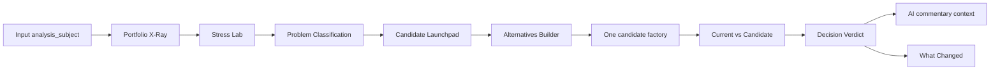

# Product Flow MVP Backend — ExecPlan

This ExecPlan is a living document. The sections `Progress`, `Surprises & Discoveries`, `Decision Log`, and `Outcomes & Retrospective` must be kept up to date as work proceeds.

This document must be maintained in accordance with [PLANS.md](../../PLANS.md) at the repository root.

Origin audit: [docs/audits/2026-05-25_product_flow_validation_audit.md](../audits/2026-05-25_product_flow_validation_audit.md). Prior alignment closed: [2026-05-25_post_architecture_alignment_roadmap.md](2026-05-25_post_architecture_alignment_roadmap.md). Backlog: `RM-ARCH-011` / `RM-ARCH-010` in [docs/ROADMAP.md](../ROADMAP.md).

**Session rule:** one chat = one session below. Update `Progress` at the end of each session and stop. Do not mix source/docs commits, generated `Main portfolio/`, and provider/IBKR work (removed root dirty-tree cleanup record).

---

## Purpose / Big Picture

After architecture-alignment docs, the backend can run the portfolio-first chain, but it does not yet feel like one product: default core runs six candidates, bundle JSON was not verified on disk, and compare does not consistently read `analysis_subject/problem_classification.json` for commentary and what-changed (`RM-ARCH-011`).

**Goal:** reach a **demo-ready MVP backend** — a clear CLI path “diagnose → one hypothesis → compare → verdict”, six product JSON files aligned by path, regression caught by an offline test without network.

**Out of scope:** UI, LLM AI Commentary (`RM-ARCH-010`), merged `product_bundle.json`, renaming `selection_decision.json`, changing stress/metrics/optimizer formulas.



---

## Roadmap after audit

| Phase | Content | Outcome |
| --- | --- | --- |
| **A — Safe baseline** | Optional: allowlisted docs commit | Stable references for agents |
| **B — Contract and regression** | Session 01: offline test on six bundle JSON files | CI catches product-flow breaks without network |
| **C — Runtime wiring** | Sessions 02–03: RM-ARCH-011 + manifest paths | Compare/commentary/what-changed see sidecar |
| **D — Product CLI (docs first)** | Session 04: document `--candidates`; Session 05: builder delegation docs/script | Official one-candidate path without new review flags |
| **E — Operator memory** | Session 06: operator guide + registers | New chats start from one guide |
| **F — Disk evidence** | Session 07: approved live demo | Gitignored `Main portfolio/` with bundle |
| **G — Closure** | Session 08: audit update + RM-ARCH-011 done | Demo-ready verdict with evidence |
| **H — Future** | Session 09 (deferred): RM-ARCH-010 LLM spec | Only if product approves LLM |

**Order:** A (optional) → **01 → 02 → 03** → 04 → 05 → 06 → 07 → 08. Session 09 is a separate wave.

**Start a new chat** only after the previous session’s done criterion; do not start 02 without green 01; do not start 07 without 02–04.

---

## Documentation: enough context for new sessions...

| Area | Enough... | Gap / action |
| --- | --- | --- |
| Implementation contract | Yes | [SPEC.md](../../SPEC.md), [OUTPUTS.md](../../OUTPUTS.md) § Product bundle |
| Per-artifact schemas | Yes | `docs/specs/*` for each bundle file |
| Orchestration order | Yes | [portfolio_review_workflow_spec.md](../specs/portfolio_review_workflow_spec.md) |
| Verification matrix | Partial | [TESTING.md](../../TESTING.md) — extend after Session 01 |
| **Single agent entry map** | **Yes** | [docs/product_flow_operator_guide.md](../product_flow_operator_guide.md) (Session 06) |
| Bundle path contract | Partial | After Session 02: operator guide + OUTPUTS RM-ARCH-011 closure |
| Registers | Update along the way | `docs/exec_plans/README.md`, `docs/audits/README.md`, `docs/ROADMAP.md` |

**Do not merge** SPEC/OUTPUTS/PRODUCT. **Do not duplicate** full formulas from metrics/stress specs.

---

## Session 00 (optional, separate chat) — Docs baseline commit

**Goal:** commit alignment docs so later sessions are not lost in ~347 dirty entries.

**Tasks:** allowlisted commit per removed root dirty-tree cleanup record §1A–1B; **do not** stage `Main portfolio/`, PDFs, provider config.

**Done when:** user explicitly requested commit; otherwise **skip** and proceed to Session 01.

---

## Session 01 — Product bundle offline integration gate (**first implementation session**)

**Goal:** offline test proves the full product bundle after synthetic `analysis_subject/` + compare — no network, no `Main portfolio/`.

**Tasks:**

1. Add [tests/test_product_bundle_integration.py](../../tests/test_product_bundle_integration.py) (prefer separate file from portfolio-first E2E).
2. In [tests/mvp_offline_fixtures.py](../../tests/mvp_offline_fixtures.py): `PRODUCT_BUNDLE_ARTIFACTS`; `seed_analysis_subject_diagnosis_bundle()` under `analysis_subject/`.
3. After `write_candidate_comparison_outputs`, assert six paths and `schema_version` on each.
4. Update [TESTING.md](../../TESTING.md).

**Do not touch:** `src/candidate_comparison.py` (wiring is Session 02), formulas, `config.yml`, generated outputs.

**Verification:**

```bash
python -m pytest tests/test_product_bundle_integration.py -q --basetemp=tmp/pytest_product_bundle_s01
```

**Done when:** pytest pass; **new chat for Session 02**.

**Assumption:** if root bundle files are missing, record in Surprises; fix in Session 02, not Session 01.

---

## Session 02 — RM-ARCH-011 sidecar wiring

**Goal:** compare, `ai_commentary_context`, and `what_changed_summary` read diagnosis bundle from `analysis_subject/` (fallback to root for legacy).

**Tasks:**

1. Add [src/product_bundle_paths.py](../../src/product_bundle_paths.py) with resolvers and `load_diagnosis_bundle_docs()`.
2. Update [src/candidate_comparison.py](../../src/candidate_comparison.py): use resolver; pass problem/launchpad into `write_ai_commentary_context_outputs` and `write_what_changed_summary_outputs`.
3. Extend Session 01 test: sidecar-only problem (no root copy) still populates commentary/what-changed refs.
4. Add [tests/test_product_bundle_paths.py](../../tests/test_product_bundle_paths.py).

**Verification:**

```bash
python -m pytest tests/test_product_bundle_paths.py tests/test_product_bundle_integration.py tests/test_ai_commentary_context.py tests/test_light_monitoring_summary.py -q
```

**Done when:** all listed tests green; **new chat for Session 03**.

---

## Session 03 — Output manifest: product bundle index

**Goal:** `output_manifest.json` lists resolved paths for all six bundle artifacts.

**Tasks:** additive `generated_paths` keys; optional `artifact_categories`; test + one OUTPUTS line.

**Done when:** manifest keys documented and tested.

---

## Session 04 — One-candidate product path (documentation only)

**Goal:** officially define the product demo command as one existing flag — **no new CLI flags in this session**.

**Primary product demo command (canonical):**

```bash
python run_portfolio_review.py --candidates equal_weight
```

Replace `equal_weight` with any supported candidate id from the factory registry when testing another hypothesis.

**Tasks:**

1. Document the command above as the **official one-candidate product path** in:
   - [docs/operational_runbook.md](../operational_runbook.md) — new subsection “Product demo (one candidate)”
   - [WORKFLOW.md](../../WORKFLOW.md) — portfolio-first operator checklist
   - [OUTPUTS.md](../../OUTPUTS.md) or [README.md](../../README.md) command matrix (one line: product demo vs routine `--mode core` research batch)
2. State explicitly: routine `python run_portfolio_review.py` / `--mode core` remains **six candidates** (`core_fast`) for Blocks 1–5 regression; product demo must use `--candidates <id>`.
3. Add or extend test in [tests/test_portfolio_review_workflow.py](../../tests/test_portfolio_review_workflow.py): `candidate_ids="equal_weight"` → `workflow_state.one_candidate`, factory argv contains single id and `--then-compare` (already partially covered — ensure documented in test name/docstring).

**Do not touch in Session 04:**

- **No** new `--candidate-method` (or similar) flag on `run_portfolio_review.py`
- **No** changes to `run_portfolio_review.py` CLI surface unless a typo fix is required for docs accuracy
- `core_fast` default profile

**Verification:**

```bash
python -m pytest tests/test_portfolio_review_workflow.py -q
python run_portfolio_review.py --candidates equal_weight --dry-run
```

**Expected output:** dry-run plan with one candidate factory step + compare; workflow state `one_candidate`.

**Done when:** docs merged and dry-run matches; **new chat for Session 05**.

**Deferred (not Session 04):** optional `--candidate-method` mapping via [src/portfolio_alternatives_builder.py](../../src/portfolio_alternatives_builder.py) — only after product approves a second CLI surface; track as backlog `RM-ARCH-012` or fold into Session 05 if needed.

---

## Session 05 — Alternatives Builder delegation (without new review CLI flag)

**Goal:** document how Launchpad method → one candidate maps to the **existing** `--candidates` command; no requirement for Session 04 CLI additions.

**Tasks:**

1. In [docs/product_flow_operator_guide.md](../product_flow_operator_guide.md) (draft in Session 06 or stub here): show `PortfolioAlternativeBuildPlan` from [src/portfolio_alternatives_builder.py](../../src/portfolio_alternatives_builder.py) and the equivalent manual command:
   - `python run_candidate_factory.py --candidates <candidate_id> --execution-mode standard --then-compare`
   - or full review: `python run_portfolio_review.py --candidates <candidate_id>`
2. Optional thin helper [scripts/run_one_candidate_from_method.py](../../scripts/run_one_candidate_from_method.py) that prints/runs the plan — **only if** it reduces operator error without changing review CLI.
3. Tests: existing [tests/test_portfolio_alternatives_builder.py](../../tests/test_portfolio_alternatives_builder.py) + doc example for `equal_weight`.

**Do not touch:** factory formulas, default `core_fast` menu.

**Done when:** operator can go from launchpad method id to a documented single command using `--candidates` only.

---

## Session 06 — Product flow operator guide + registers

**Goal:** one file for any new chat/agent.

**Tasks:** create [docs/product_flow_operator_guide.md](../product_flow_operator_guide.md); set Active pointer in [docs/exec_plans/README.md](README.md); link audit in [docs/audits/README.md](../audits/README.md); one line in [AGENTS.md](../../AGENTS.md).

**Done when:** guide lists read order, commands (including `python run_portfolio_review.py --candidates equal_weight`), path map, and anti-patterns (do not use health score as main answer).

---

## Session 07 — Approved live demo baseline

**Goal:** prove bundle on disk under `Main portfolio/` (gitignored).

**Tasks:**

1. User approval for network + generated refresh.
2. Run: `python run_portfolio_review.py --candidates equal_weight`
3. OUTPUTS bundle checklist; write [docs/audits/2026-05-25_product_flow_demo_baseline_snapshot.md](../audits/2026-05-25_product_flow_demo_baseline_snapshot.md)

**Do not commit** `Main portfolio/` unless user asks.

---

## Session 08 — Product flow validation closure

**Goal:** close audit findings with runtime evidence.

**Tasks:** update [product-flow validation audit](../audits/2026-05-25_product_flow_validation_audit.md); `RM-ARCH-011` → Done in ROADMAP; ExecPlan Outcomes; full pytest bundle (same as Session 02 plus workflow tests).

**Done when:** audit states demo-ready backend with evidence.

---

## Session 09 (deferred) — RM-ARCH-010 AI Commentary spec draft

Docs-only draft for future LLM prose. Start only after Session 08 and product approval.

---

## Progress

- [ ] Session 00 — docs baseline commit (optional)
- [x] (2026-05-25) Session 01 — product bundle offline integration gate: `PRODUCT_BUNDLE_ARTIFACTS`, `seed_analysis_subject_diagnosis_bundle`, `seed_product_bundle_offline_workspace`, `tests/test_product_bundle_integration.py`, `TESTING.md` adapter map row.
- [x] (2026-05-26) Session 02 — RM-ARCH-011 sidecar wiring: `src/product_bundle_paths.py`, compare passes diagnosis bundle into AI commentary and What Changed, `tests/test_product_bundle_paths.py`, extended integration gate for sidecar-only refs.
- [x] (2026-05-26) Session 03 — output manifest product paths: `product_bundle_generated_paths_for_manifest`, `artifact_categories` on compare manifest, report manifest uses resolved diagnosis paths, integration/path tests, `OUTPUTS.md` line.
- [x] (2026-05-26) Session 04 — one-candidate path (docs only; `--candidates equal_weight`): runbook § Product demo, WORKFLOW checklist, OUTPUTS/README command matrix, `test_official_one_candidate_product_path_equal_weight`.
- [x] (2026-05-26) Session 05 — alternatives builder delegation: `docs/product_flow_operator_guide.md` (Launchpad → plan/commands), `scripts/run_one_candidate_from_method.py`, runbook/WORKFLOW links, `test_equal_weight_launchpad_method_maps_to_documented_product_commands`.
- [x] (2026-05-26) Session 06 — operator guide + registers: full [product_flow_operator_guide.md](../product_flow_operator_guide.md) (read order, commands, path map, anti-patterns); Active pointer in [exec_plans/README.md](README.md); audit row in [audits/README.md](../audits/README.md); [AGENTS.md](../../AGENTS.md) link.
- [x] (2026-05-26) Session 07 — live demo baseline: `python run_portfolio_review.py --candidates equal_weight` (~120 s); six bundle JSON PASS under `Main portfolio/`; [demo baseline snapshot](../audits/2026-05-25_product_flow_demo_baseline_snapshot.md). Caveats: compare favored stale `risk_parity` over requested `equal_weight`; `output_manifest.json` lacks product_bundle keys after factory write.
- [x] (2026-05-26) Session 08 — validation closure: audit § Session 08 + §11; `RM-ARCH-011` → Done in ROADMAP; pytest **46 passed** (`test_product_bundle_paths`, `test_product_bundle_integration`, `test_ai_commentary_context`, `test_light_monitoring_summary`, `test_portfolio_review_workflow`, `test_portfolio_alternatives_builder`); registers updated; ExecPlan **Completed**.
- [ ] Session 09 — RM-ARCH-010 spec (deferred)

## Surprises & Discoveries

- Observation: Session 01 offline gate passes without changing `candidate_comparison.py`; all six bundle files are written when `analysis_subject/` sidecar and at least one candidate snapshot exist.
  Evidence: `python -m pytest tests/test_product_bundle_integration.py -q --basetemp=tmp/pytest_product_bundle_s01` → 1 passed in ~3.4s.
- Observation: `ai_commentary_context.json` uses `purpose=grounded_ai_commentary_context` and `guardrails.does_not_call_llm`, not a top-level `grounding_only` field.
  Evidence: integration test adjusted to match [src/ai_commentary_context.py](../../src/ai_commentary_context.py).
- Observation (Session 07): One-candidate factory (`equal_weight`, `skipped_existing`) still produced compare/selection over **12** on-disk candidates; `favored_candidate_id` = `risk_parity`, not `equal_weight`.
  Evidence: [demo baseline snapshot](../audits/2026-05-25_product_flow_demo_baseline_snapshot.md) § C1; `selection_decision.json` / `current_vs_candidate.json` on `Main portfolio/`.
- Observation (Session 07): Post-run `output_manifest.json` has `run_kind=candidate_factory` only; six `product_bundle_*` manifest keys from Session 03 not present on disk after `--then-compare`.
  Evidence: demo baseline snapshot § C2.

## Decision Log

- Decision: Session 01 does not fix compare wiring; Session 02 owns RM-ARCH-011.
  Rationale: Keeps the first implementation chat small and test-driven.
- Decision: No merged `product_bundle.json` (inherits architecture alignment Session 11).
  Rationale: Per-artifact adapters + manifest keys are sufficient.
- Decision: Default `run_portfolio_review.py --mode core` stays six-candidate for regression; product demo uses explicit `--candidates <id>`.
  Rationale: Audit C2 — product vs research paths must diverge explicitly.
- Decision: Session 04 is **documentation and verification only**; canonical one-candidate command is `python run_portfolio_review.py --candidates equal_weight` (or another candidate id). **Do not** add `--candidate-method` in Session 04.
  Rationale: Flag already exists; avoids CLI churn before demo proof. Optional sugar deferred to a later session if product requests it.
- Decision: Session 05 documents Alternatives Builder → `--candidates` mapping without requiring a new orchestrator flag.
  Rationale: [src/portfolio_alternatives_builder.py](../../src/portfolio_alternatives_builder.py) already returns a factory command plan.
- Decision: Session 05 adds `scripts/run_one_candidate_from_method.py` (print by default; `--run` for factory only).
  Rationale: Reduces operator error mapping Launchpad method ids without new `run_portfolio_review.py` flags.
- Decision: Session 08 closes audit as **demo-ready MVP backend** while accepting Session 07 C1/C2 (stale compare scope; factory manifest without `product_bundle_*` keys).
  Rationale: Six-file bundle contract and RM-ARCH-011 wiring are proven; interpretability caveats are operator/documentation scope, not open wiring defects.
- Decision: ExecPlan marked **Completed** after Session 08; Session 09 (`RM-ARCH-010`) is a separate deferred wave.
  Rationale: Plan scope ended at validation closure; LLM requires product approval.

## Outcomes & Retrospective

**Plan status: Completed** (2026-05-26, Session 08). Session 09 (`RM-ARCH-010` LLM spec) remains a separate deferred wave.

**Achieved:**

- Offline regression gate for all six Core MVP product bundle JSON files (`tests/test_product_bundle_integration.py`).
- `RM-ARCH-011` closed: `analysis_subject/` sidecar resolution for problem/launchpad in compare, AI commentary, and What Changed; manifest product-bundle path keys (compare path).
- Documented product demo CLI: `python run_portfolio_review.py --candidates equal_weight` (routine `--mode core` stays six-candidate).
- Single operator entry: [product_flow_operator_guide.md](../product_flow_operator_guide.md); Launchpad method → factory via `scripts/run_one_candidate_from_method.py`.
- Live disk evidence: [demo baseline snapshot](../audits/2026-05-25_product_flow_demo_baseline_snapshot.md) — six bundle files PASS; audit closure with accepted caveats (stale compare scope, factory manifest vs compare manifest).

**Verification (Session 08):** `python -m pytest tests/test_product_bundle_paths.py tests/test_product_bundle_integration.py tests/test_ai_commentary_context.py tests/test_light_monitoring_summary.py tests/test_portfolio_review_workflow.py tests/test_portfolio_alternatives_builder.py -q` → **46 passed** in ~3.4 s.

**Residual (out of plan scope):** UI; `RM-ARCH-010` LLM; merged `product_bundle.json`; dirty-tree migration commit; CI live-network bundle E2E; clean one-hypothesis selection when stale variant folders exist on disk (operator hygiene).

## Implementation note

**First implementation chat:** execute **Session 01 only**, then stop. Do not start Session 02 in the same chat unless the user explicitly expands scope.
